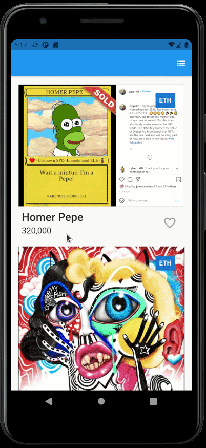

# NFT project

View and save reasonably priced nfts.

## 1. Build the card layout

Code: https://dartpad.dev/617434e3c0cb99f255fb25a36474a26f?null_safety=true

- Create the Card Layout in the `_buildRow` method
- Fix the `onTap` function in `GestureDetector`. When the favorite icon is tapped, the icon should change color and the nft should be added/removed from the favourites page

## 2. Fetch data asynchronously

Code: https://dartpad.dev/a5cf4b25be39d476f6fa5ba10be16e40?null_safety=true

- Fetch data using the `_fetchNfts` function

## 3. Refactor navigation

Code: https://dartpad.dev/359e9b3e6cdf145fabe2d7e216583472?null_safety=true

- Extract the code in the `_goToFavourites` method into a `FavoritePage` StatelessWidget
- Refactor to use the `routes` param for navigation

# Intro to Flutter

Flutter is a UI framework for developing cross-platform applications.

## Widgets

You build your UI out of widgets. Widgets describe what the UI should look like.

Code: https://dartpad.dev/cec5855b7ad491ec68368f7526044b90?null_safety=true

Widgets are subclasses of either StatelessWidget or StatefulWidget, depending on whether your widget manages any state. A widget’s main job is to implement a `build()` function, which describes the widget in terms of other lower-level widgets.

All widgets fall in one of three categories:

1. Layout - E.g. `Column` and `Row` widgets which layout other widgets vertically or horizontally.
2. Painting - E.g. `Text` and `Image` widgets allow us to display (‘paint’) some content onto the screen.
3. Hit-Testing - E.g. `GestureDetector` allows us to recognise different gestures such as tapping and dragging/swiping.

## Layout

Code: https://dartpad.dev/4dd5c3ec602e6044cb042150c1596808?null_safety=true

### Row and Column

These flex widgets let you create flexible layouts in both the horizontal (`Row`) and vertical (`Column`) directions. The design is based on the web’s flexbox layout model.

Docs: https://flutter.dev/docs/codelabs/layout-basics#axis-size-and-alignment

### Flexible

`Row` and `Column` first lay out widgets of a fixed size. Fixed size widgets are considered inflexible because they can’t resize themselves after they’ve been laid out.

The `Flexible` widget wraps a widget, so the widget becomes resizable.

Docs: https://flutter.dev/docs/codelabs/layout-basics#flexible-widget

### Expanded

The `Expanded` widget forces the widget to fill extra space.

Docs: https://flutter.dev/docs/codelabs/layout-basics#expanded-widget

### Stack

Instead of laying out widgets horizontally or vertically, a `Stack` widget lets you place widgets on top of each other.

You can then use the `Positioned` widget on children of a `Stack` to position them relative to the top, right, bottom, or left edge of the stack. Stacks are based on the web’s absolute positioning layout model.

## State management

Code: https://dartpad.dev/a001346f03867f2fa667e3b40af2c05a?null_safety=true

`StatefulWidget` and `State` are separate objects with different life cycles. Widgets are temporary objects, used to construct a presentation of the application in its current state.

`State` objects, are persistent between calls to `build()`, allowing them to remember information.

Stateful Widget lifecycle
https://stackoverflow.com/questions/41479255/life-cycle-in-flutter

## Networking and JSON Serialization

_Encoding or serialization_ means turning a data structure into a string.

_Decoding or deserialization_ means turning a string into a data structure.

## Navigation

Pages are called routes and they're managed by a `Navigator` widget.

The navigator manages a stack of `Route` objects with the most recently visited pages on top of the stack and the least recently visited page at the bottom of the stack.
